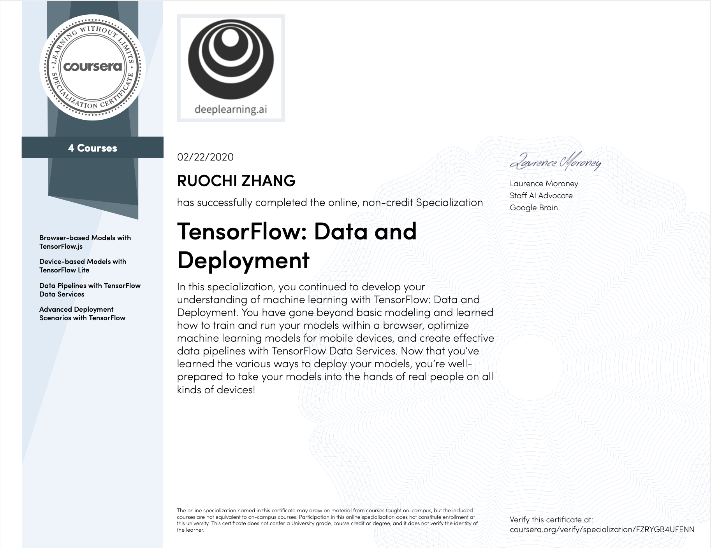

# TensorFlow-Data-and-Deployment

**About this Specialization**

Continue developing your skills in TensorFlow as you learn to navigate through a wide range of deployment scenarios and discover new ways to use data more effectively when training your model.

In this four-course Specialization, you’ll learn how to get your machine learning models into the hands of real people on all kinds of devices. Start by understanding how to train and run machine learning models in browsers and in mobile applications. Learn how to leverage built-in datasets with just a few lines of code, use APIs to control how data splitting, and process all types of unstructured data. Apply your knowledge in various deployment scenarios and get introduced to TensorFlow Serving, TensorFlow, Hub, TensorBoard, and more.

Industries all around the world are adopting AI. This Specialization from Laurence Moroney and Andrew Ng will help you develop and deploy machine learning models across any device or platform faster and more accurately than ever.

## Browser-based Models with TensorFlow.js

**About this Course**

Bringing a machine learning model into the real world involves a lot more than just modeling. This Specialization will teach you how to navigate various deployment scenarios and use data more effectively to train your model.

In this first course, you’ll train and run machine learning models in any browser using TensorFlow.js. You’ll learn techniques for handling data in the browser, and at the end you’ll build a computer vision project that recognizes and classifies objects from a webcam.

This Specialization builds upon our TensorFlow in Practice Specialization. If you are new to TensorFlow, we recommend that you take the TensorFlow in Practice Specialization first. To develop a deeper, foundational understanding of how neural networks work, we recommend that you take the Deep Learning Specialization.

### Certificate

### Week1
- Specialization Introduction
- Training and Inference using TensorFlow.js in JavaScript
- Training Models with CSV Files
- [Lecture Code](./wee1/Examples)
- [Programming Assignment: Week 1 - Breast Cancer Classification](./week1/Exercise)

### week2
- Creating Convolutional Neural Networks in JavaScript
- Using a Sprite Sheet
- MNIST Classifier
- [Lecture Code](./wee2/Examples)
- [Programming Assignment: Week 2 - Fashion MNIST Classifier](./week2/Exercise)

### week3
- Toxicity Classifier
- Image Classification Using MobileNet
- Converting Models to JSON Format
- [Lecture Code](./wee3/Examples)
- [Programming Assignment: Week 3 - Converting a Python Model to JavaScript](./week3/Exercise)

### week4

- Retraining the MobileNet Model
- Capturing the Data
- Performing Inference From the Webcam Feed
- [Lecture Code](./wee4/Examples)
- [Programming Assignment: Week 4 - Rock Paper Scissors](./week4/Exercise)

### week5

- Course Introduction
- Machine Learning Models in Mobile and Embedded Systems
- Taking a look at the saved model format
- First primer on running models on mobile devices
- [Lecture Code](./wee5/Examples)
- [Programming Assignment: Week 5 - Train Your Own Model and Convert It to TFLite](./week5/Exercise)

### week6
- Running a TF model in an Android App
- Introduction
- Basic image classification
- Classifying camera images
- Code walkthrough - camera image classifier
- Object detection
- Code walkthrough of an object detection app
- Optional Exercise: Rock Paper Scissors for Android

### week7
- Building the TensorFLow model on IOS
- Introduction
- Next steps
- Classification and detection
- Optional Exercise - Rock, Paper, Scissors on iOS

### week8
- TensorFlow Lite on devices
- Introduction
- Example: Raspberry Pi
- Raspberry pi demo
- Microcontrollers
- Optional Exercise - Rock Paper Scissors on Raspberry Pi

### week9

- Data Pipelines with TensorFlow Data Services
- Introduction
- Starting the code
- Splitting the data
- Splits and slices API for datasets in TF
- [Lecture Code](./wee9/Examples)
- [Programming Assignment: Week 9 - Exercise 1](./week9/Exercise)

### week10
- Programming APIs and column types
- Going over the Notebook
- Loading data and extracting
- Looking at the code
- Loading data
- [Lecture Code](./wee10/Examples)
- [Programming Assignment: Week 10 - Exercise 2](./week10/Exercise)

### week11
- Tuning and performance improvements in your pipeline
- Methodologies to improve performance
- Best practices
- [Programming Assignment: Week 11 - Exercise 3](./week11/Exercise)

### week12
- Sharing your custom data
- Colab
- [Programming Assignment: Week 12- Exercise 4](./week12/Exercise)

### week13

- TF serving as another deployment option for the model and ways to install it
- Building a model and deploying to TF Serving
- Passing data to and from the model
- Looking into a more complex model using the Fashion MNIST dataset
- [Programming Assignment: Week 13 - Exercise 1](./week13/Exercise)

### week14
- TF Hub
- Text based models
- Image classification
- [Programming Assignment: Week 14 - Exercise 2](./week14/Exercise)

### week15

- Overview of Tensorboard
- Local Tensorboard
- Graphics and confusion matrix
- [Programming Assignment: Week 15 - Exercise 3](./week15/Exercise)

### week16

- Intro to Federated Learning
- Privacy and masking
- Federated Learning APIs

